# RPG Computer Terminal

This webapp is an old computer terminal tool for your TTRPG session.

## How to customize it
Each server can be configured in the public/config/network folder. <br/>

Each folder you create in there will become a new server, the name of the server is the folder's name. You can use the default one "localhost" as reference.

## Servers
In this section we will cover how you can customize your servers

### Interface

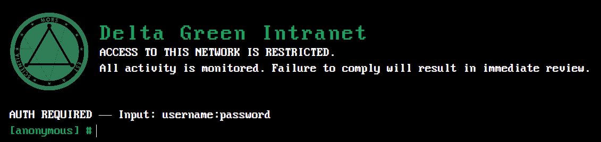

The interface (logo, welcome message, commands) configuration is located in `manifest.json`

`serverAddress` Must be the same as your folder's name <br/>
`serverName` Is the name that will be displayed<br/>
`iconName` Is the name of your image file that will be displayed for instance delta-green.png <br/>
`commands` Is the list of commands you want available on this specific server, they will be displayed when the user types "help" 

### userlist

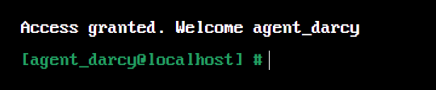

The users list can be configured in the `userlist.json` file on each server <br/>

The users list for this specific server, each user has 3 required parameters :

`userId` Is the username the player will need to type when logging in <br/>
`password` Is the password the player will need to type when logging in<br/>
`userName` Is the name that will be displayed on screen once the player is logged in 

### Decryption

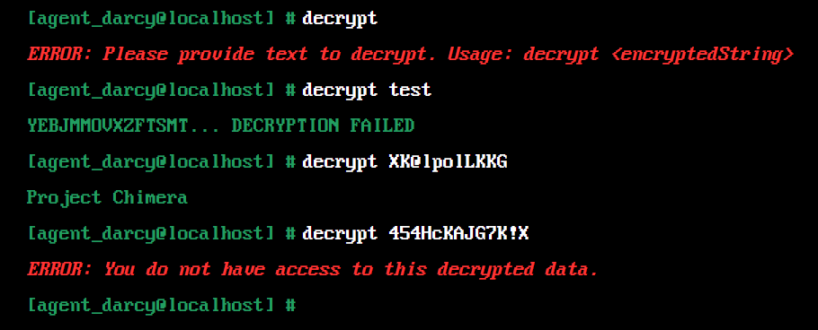

The decryption list can be configured in the `decryption.json` file on each server <br/>

The decryption list for this specific server, each decryption has 3 required parameters :

`encrypted` The character string the user must type to decrypt it<br/>
`decrypted` The decrypted result <br/>
`authorizedUsers` The list of users (userId) that have the rights to see the decrypted result

### Emails

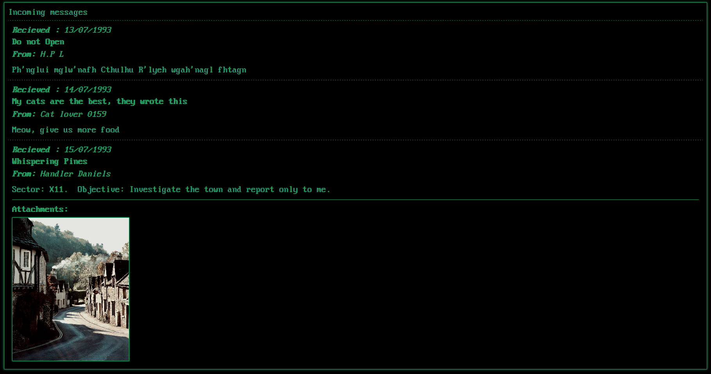

The emails list can be configured in the `mailserver.json` file on each server <br/>

The emails list for this specific server, each decryption has 5 required parameters and 1 optional :

`from` The name of the expeditor that will be displayed<br/>
`to` The list of users (userId) that can access this mail<br/>
`date` The date the mail was received on that will be displayed <br/>
`title` The title of the mail that will be displayed <br/>
`body` The content of the mail that will be displayed <br/>
`image` (optional) The image that will be attached to the mail <br/>

### Help Command

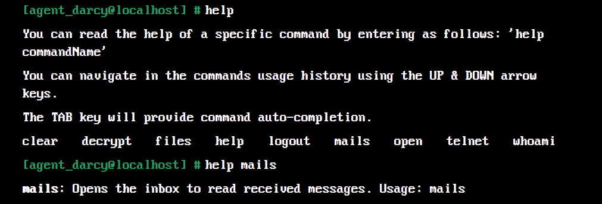

The help command will list each commands available on the server. <br/>
Each command can be detailed by typing `help commandName`, you can customize the text that will be displayed for each command in the `helpDetails.json` file located in the `config` folder <br/>

Each command has 2 required parameters :

`commandName` The name of the command <br/>
`commandHelp` The detailed instructions for the command

## Files

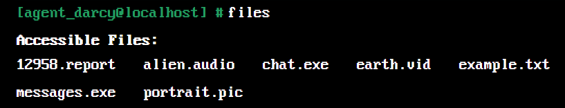

Each server has its own files. There is currently 5 types of files you can add to the server

`Text files` 
`Image files` 
`Video files` 
`Audio files` 
`Report files`

Each file has multiple parameters based on their type, however they all share 2 required parameters :

`name` The name of the file<br/>
`authorizedUsers` Is an array of objects that contains 2 required parameters :
* **userId** will grant access to the file to the specified user
* **hidden** (Boolean) will hide the file from the *files* command for the specified user, it can be useful if you want to add a secret file to the server that your player can discover after obtaining the file's name during your TTRPG sessions 

For multimedia files such as Audios, Images and Videos, you will need to add your files in the folder audios | images | videos in each server.


### Text files

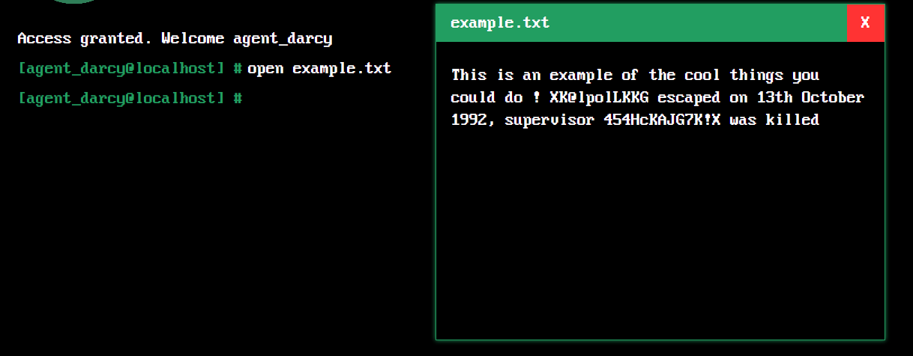

Text files can be configured in the `txtfiles.json` file on each server, excluding the shared parameters, each file contains 1 required parameter : 

`content` The content of the file that will be displayed<br/>

**Important note :** by default the `name` parameter of each textfile must end with *.txt* , you can change this behavior by configuring the code if you wish

### Image files

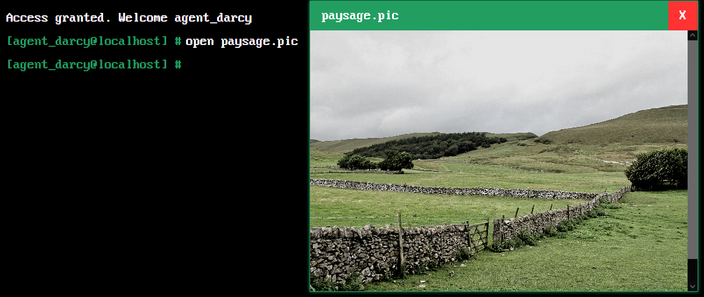

Image files can be configured in the `picfiles.json` file on each server, excluding the shared parameters, each file contains 1 required parameter :

`content` The name of the image file located in the images folder from this server<br/>

**Important note :** by default the `name` parameter of each image must end with *.pic* , you can change this behavior by configuring the code if you wish

### Video files

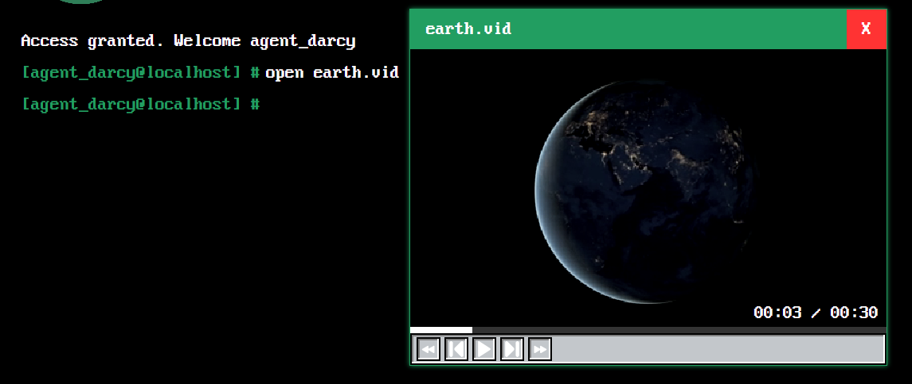

Video files can be configured in the `vidfiles.json` file on each server, excluding the shared parameters, each file contains 1 required parameter :

`content` The name of the video file located in the videos folder from this server<br/>

**Important note :** by default the `name` parameter of each video must end with *.vid* , you can change this behavior by configuring the code if you wish

### Audio files

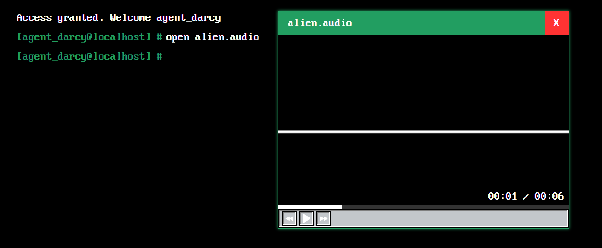

Audio files can be configured in the `audiofiles.json` file on each server, excluding the shared parameters, each file contains 1 required parameter :

`content` The name of the audio file located in the audios folder from this server<br/>

**Important note :** by default the `name` parameter of each audio must end with *.audio* , you can change this behavior by configuring the code if you wish

### Report files

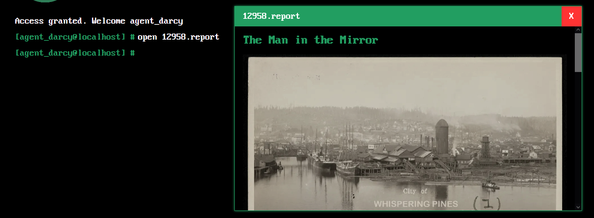

Report files where conceived for the Delta Green RPG, you can of course use it for other games if you wish to do so

Report files can be configured in the `reportfiles.json` file on each server, excluding the shared parameters, each file contains 3 required parameters and 1 optional :

`title` The title that will be displayed at the start of the report<br/>
`content` The content of the file that will be displayed<br/>
`image` The name of the image file located in the images folder from this server<br/>
`agents` (optional) The list of agents related to this report, each agent has 8 parameters :
* **name** : The agent's name
* **number** : The agent's ID number
* **since** : The date since when the agent is a Delta Green Agent
* **height** : The agent's height
* **weight** : The agent's weight
* **photo** : The agent's photo, it's the name of the image file located in the images folder from this server
* **status** : The agent's current status (active, missing, dead...)
* **information** : Any other information you want to add for this agent, it will be displayed as plain text

**Important note :** by default the `name` parameter of each report must end with *.report* , you can change this behavior by configuring the code if you wish

## Executables

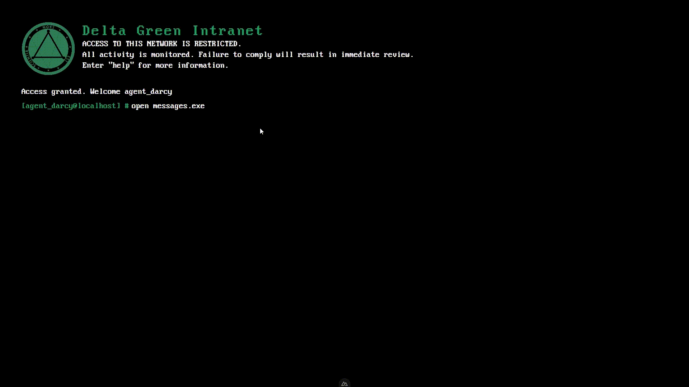

Executables are more advanced and custom scripts that you can add to your terminal, it will require some javascript and Vue3 knowledge. <br/>

If you want to add a new executable you can do so in `exefiles.json`, it shares the same parameters as all the other files. <br/>

All you need to do now is create a new Vue component in `components/Executables` and start coding your own script for your custom needs. <br/>

Your component will be displayed in a window and added to the files list just as any other basic files.

**Important note :** by default the `name` parameter of each executable must end with *.exe* , you can change this behavior by configuring the code if you wish

## Setup

Make sure to install dependencies:

```bash
# npm
npm install

# pnpm
pnpm install

# yarn
yarn install

# bun
bun install
```

## Development Server

Start the development server on `http://localhost:3000`:

```bash
# npm
npm run dev

# pnpm
pnpm dev

# yarn
yarn dev

# bun
bun run dev
```

## Production

Build the application for production:

```bash
# npm
npm run build

# pnpm
pnpm build

# yarn
yarn build

# bun
bun run build
```

Locally preview production build:

```bash
# npm
npm run preview

# pnpm
pnpm preview

# yarn
yarn preview

# bun
bun run preview
```
